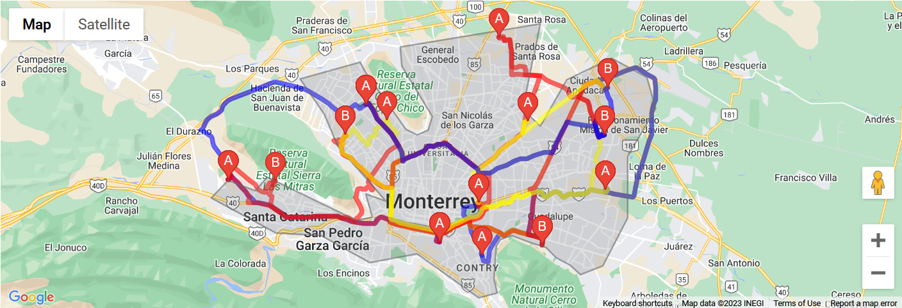

# Resolviendo un problema de ruteo de vehículos con capacidad a traves de GRASP

El problema de generación de rutas para vehículos (VRP) es una variación del problema del viajante de comercio
(TSP). Este problema implica determinar el conjunto óptimo de rutas para que una flota de vehículos entregue bienes o brinde servicios a un conjunto de clientes. El objetivo es minimizar la distancia total recorrida o el costo total mientras se satisfacen varias restricciones, como las limitaciones de capacidad del vehículo o las ventanas de tiempo del cliente. 

Este proyecto trabaja sobre VRPPD, donde los vehículos son responsables de recoger artículos y entregarlos a otros destinos específicos mientras minimizan la distancia total o el costo. Resolver estos problemas de manera óptima puede ser computacionalmente costoso, por lo que se han desarrollado varios algoritmos y heurísticas para encontrar soluciones casi óptimas de manera eficiente.

Este tipo de problema es clásico en el ámbito de la logística, y podemos entenderlo como el problema que podría tener una industria en Monterrey con servicio de transporte para sus trabajadores. Este servicio busca recorrer las viviendas de sus trabajadores con un número especifico de vehículos minimizando los costos asociados, como el tiempo de uso del transporte y la distancia recorrida.

El objetivo es minimizar el costo asociado a las rutas dadas las viviendas de los trabajadores utilizando un algoritmo GRASP pseudo aleatorio para obtener soluciones al problema. El resultado a obtener son las rutas óptimas de los vehículos de la empresa.

Los siguientes archivos generan la Figura 3 del reporte utilizando la API de Google Maps.

- random_point_generator Utiliza un polígono en el cual se selecciona de forma aleatoria puntos en el mapa de NL, los cuales son utilizados en ditance_matrix_generator.ipynb.

- ditance_matrix_generator.ipynb Genera la matriz de distancias con los datos obtenidos de Google Maps, esta matriz se utiliza en GRASP.ipynb.

- mapping_route_solutions.ipynb Crea la Figura 3 del reporte a partir de solutions.json, que es el archivo generado a partir de GRASP.ipynb.
